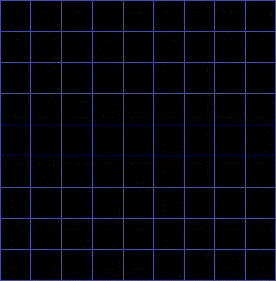

# Описание Системы Навигации

## Общая концепция

Система навигации для автономного робота предназначена для поиска кратчайшего пути на карте, содержащей препятствия. Робот использует карту, представленную в виде матрицы, где 0 означает свободную ячейку, а 1 — препятствие. 

### Основные компоненты системы:
1. **Генерация карты**: создаёт поле (матрицу), представляющее собой пространство для движения робота. Каждая ячейка матрицы может быть либо свободной (0), либо занята препятствием (1).
2. **Алгоритм поиска пути A-Star**: реализует поиск кратчайшего пути от начальной точки до конечной, обходя препятствия.
3. **Оптимизация пути**: уменьшает найденный маршрут, путем добавления "срезок" для углов по диагоналям.

### Особенности:
- Эффективность работы системы навигации напрямую зависит от карты и параметров эвристики.
- Алгоритм **A\*** гарантирует нахождение оптимального пути, если он существует.
- Генерация карты и задание препятствий происходят случайным образом, что позволяет моделировать различные сценарии окружающей среды.
- Система поддерживает гибкость настройки карты (размеры, плотность препятствий), что помогает адаптировать её под различные условия эксплуатации.
- Возможность оптимизации маршрута для уменьшения количества поворотов робота и сокращения времени перемещения.
- Лёгкость интеграции благодаря минимальному числу внешних зависимостей.

### Ограничения системы:
- Карта не может быть меньше **2x2** клеток.
- Вероятность появления препятствий ограничена диапазоном от **0** до **1**.
- Алгоритм не поддерживает динамическое изменение карты во время выполнения (препятствия задаются только на этапе инициализации).
- Робот перемещается только по четырём направлениям (вверх, вниз, влево, вправо) в основной фазе поиска пути, что ограничивает гибкость маршрута и может привести к не оптимальному маршруту при малом количестве препятствий. На рисунке 1 представлен не оптимальный маршрут в условиях низкой плотности препятствий.

  
  
  Рисунок 1. Не оптимальный маршрут в условиях низкой плотности препятствий

- Большие размеры карты и высокая плотность препятствий могут значительно замедлить работу алгоритма и потребовать значительных вычислительных ресурсов.
- Физические характеристики робота (скорость, размер, манёвренность) не учитываются в системе навигации.

## Описание алгоритма A*

Алгоритм A* — это один из самых популярных и эффективных алгоритмов для поиска кратчайшего пути в графах и на сетках. Его основная задача — найти оптимальный путь от начальной точки до конечной, при этом учитывая стоимость передвижения по ячейкам и нацеливаясь на минимизацию общего пути. 
A* пошагово просматривает все пути, ведущие от начальной вершины в конечную, пока не найдёт минимальный.
Алгоритм использует два основных параметра для оценки каждого узла (точки) на карте:
- **g(x)**: фактическая стоимость пути от начальной точки до текущей точки x. Это сумма всех затрат на перемещение по каждой ячейке на пути до этой точки.
- **h(x)**: эвристическая оценка стоимости перемещения от текущей точки x до целевой. Используется манхэттенское расстояние (сумма абсолютных разностей координат).
Общая оценка для точки вычисляется как сумма этих двух параметров:
f(x) = g(x) + h(x),
где f(x) — это прогнозируемая полная стоимость пути через точку x.

    

    Рисунок 2. Пример работы алгоритма A-star.

## Основные этапы работы алгоритма A*
1.	**Инициализация**:
- Алгоритм начинает с исходной точки (например, (0, 0)).
- Каждой точке присваивается значение g(x) и f(x). Для исходной точки g(x) = 0, а f(x) равняется значению эвристики h(x).
- Исходная точка помещается в приоритетную очередь (кучу), где на первом месте всегда находится точка с минимальным значением f(x).
2.	**Поиск**:
- Алгоритм извлекает из очереди точку с наименьшим значением f(x) и помечает её как "обработанную".
- Для каждого соседа этой точки вычисляется новая стоимость пути g(x). Если новая стоимость меньше ранее вычисленной для данного узла, обновляются его значения g(x) и f(x).
- Все соседние точки, которые ещё не обработаны, добавляются в очередь на дальнейшую обработку.
3.	**Завершение**:
- Алгоритм повторяет этот процесс, пока не достигнет целевой точки, либо пока не обработает все доступные пути.
- Когда целевая точка достигнута, путь восстанавливается, следуя от целевой точки назад через все посещённые точки с минимальной стоимостью.
4.	**Возврат результата**:
- Если целевая точка достижима, алгоритм возвращает список координат, составляющих кратчайший путь.
- Если путь не найден (например, если целевая точка окружена препятствиями), возвращается результат о том, что путь отсутствует.

