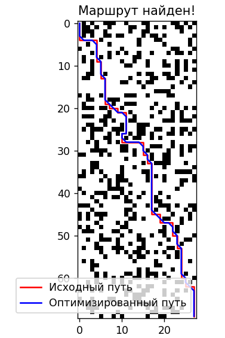
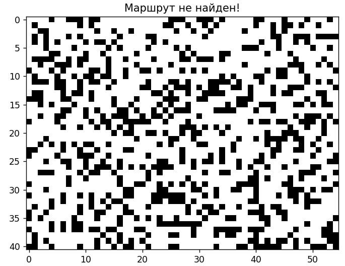

## 3. Руководство пользователя

### 3.1 Введение
Данное руководство объясняет процесс использования системы навигации для автономного робота. Система позволяет задавать начальную и конечную точки, производить поиск пути, визуализировать карту пространства и путь робота. В этом разделе также описаны возможные ошибки, такие как отсутствие пути из-за препятствий, и их обработка.

### 3.2 Использование системы навигации

#### 3.2.1 Установка начальной и конечной точек

Пользователь может задать координаты начальной и конечной точек. Координаты вводятся в формате `(x, y)`, где `x` и `y` — это целые числа, соответствующие положению на карте. Для введения координат точек используется функция find_path, содержащая следующие параметры:
- robo_map: Матрица, представляющая собой поле перемещения.
- start: Координаты первого участка пути. По умолчанию (0, 0). 
- target: Координаты конечного участка пути. По умолчанию - последний элемент матрицы robo_map.

Пример установки начальной и конечной точек:
```python
# Установка точек
default_path = find_path(mappy) # Генерация пути с точками по умолчанию
default_path = find_path(mappy,(1, 2)) # Установка начальной точкой (1, 2) и конечной точки по умолчанию
default_path = find_path(mappy, ,(1, 2)) # Установка начальной точки по умолчанию и конечной точки (1, 2)
default_path = find_path(mappy, (3, 2), (1, 2)) # Установка начальной точки (3, 2) и конечной точки (1, 2)
```

> **Примечание:** Начальная и конечная точки должны находиться в пределах карты и не должны совпадать с координатами препятствий.

#### 3.2.2 Интерпретация результатов поиска пути

После успешного выполнения поиска пути система возвращает пользователю несколько типов данных:

- **Карта:**
  - Система рисует карту по которой будет проложен маршрут, используя матрицу `mappy`.

- **Статус поиска пути:**
  - Система информирует, успешно ли был найден путь:
    - `Путь найден.`
    - `Путь не найден.`

- **Маршрут:**
  - Набор точек `(x, y)`, которые составляют кратчайший или оптимальный путь от начальной до конечной точки. Эти точки выводятся в формате списка координат и отображаются на карте.
  - Маршрут не отображается на карте, если путь не найден
  


#### 3.2.3 Визуализация карты пространства и пути

Система предоставляет возможность визуализации карты и маршрута робота, включающую:
- Свободные клетки — доступные для перемещения. Отображаются белым цветом.
- Препятствия — заблокированные клетки, где робот не может пройти. Отображаются черным цветом.
- Начальную и конечную точки.
- Найденный маршрут — не оптимизированный путь робота. Отображается красной линией.
- Оптимизированный маршрут — оптимизированный путь робота. Отображается синей линией.
  
На рисунке 1 представлен результат работы системы при параметрах по умолчанию.



Рисунок 1. Результат работы системы

### 3.3 Обработка ошибок

#### 3.3.1 Отсутствие пути

Если система не может найти путь из-за блокирующих препятствий, будет выведено сообщение:  
```
Путь не найден.
```
На рисунке 2 представлен результат работы системы при параметрах по умолчанию, в случае отсутствия пути.



Рисунок 2. Отсутствие пути

В этом случае, рекомендуется:
- Перенести начальную и конечную точки — они не должны располагаться на препятствиях.
- Изменить конфигурацию карты, удалив или переместив препятствия.

#### 3.3.2 Выход за пределы карты

Если начальная или конечная точка выходят за пределы карты,будет выведено сообщение:  
```
Путь не найден.
```

В этом случае, рекомендуется: 
- Задать новые точки и убедиться, что они находятся внутри допустимого диапазона координат карты.
- Задать новые размеры карты, охватывающие обе точки.

